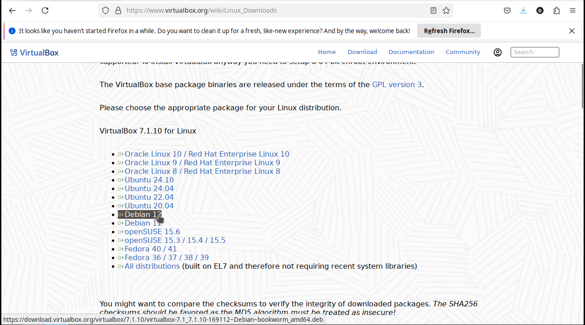
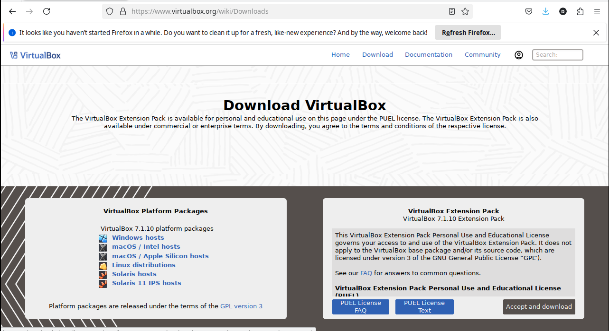

Instalación de Virtualbox en Debian 12 (y/o derivado)

> En este caso de uso se instala VirtualBox sobre un Debian 12. El mismo procedimiento es identico de realizar en distribuciones superiores y/o derivadas de Debian (ejemplo Ubuntu, Linux Mint, Q4os).
>

## Revisión versión Linux instalado

## Visitar página de Descarga de VirtualBox

## Descarga de Virtualbox (desde el CLI)

