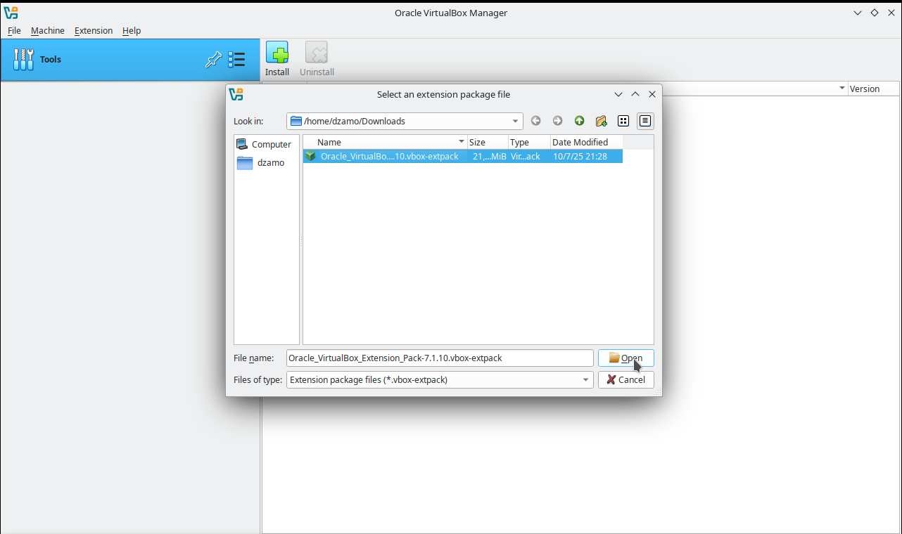

Instalación de Virtualbox en Debian 12 (y/o derivado)

> En este caso de uso se instala VirtualBox sobre un Debian 12. El mismo procedimiento es identico de realizar en distribuciones superiores y/o derivadas de Debian (ejemplo Ubuntu, Linux Mint, Q4os).
>

## Revisión versión Linux instalado

## Instalación (configución mínima inicial) de VirtualBox

### Visitar página descarga de Virtualbox

### Descarga de Virtualbox (desde el CLI)

### Instalación de Virtualbox (desde el CLI)

### usermod vboxusers $USER

## Instalación VirtualBox Extension Pack (opcional)

### Descarga de VBox Ext P

### Instalación de VBox Ext P

