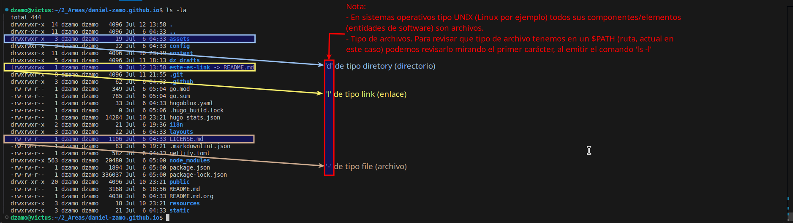

+++
author = "dz"
title = "Linux CLI - gestión básica de archivos"
#date = "2025-07-13"
date = 2025-07-14T00:00:00-03:00
description = "Gestión básica de archivos, link de referencia/estudio; tipos de archivos"
tags = [
    "LPIC-102",
    "LPIC-101",
    "linux",
]
categories = [
    "linux-cli",
    "curso-3182",
]
series = ["Linux CLI introducción"]
#aliases = [""]
image = "ls-check-file-type.png"
+++

¡En Linux, todo es un archivo! Aprender comandos básicos para navegar, copiar y gestionar archivos, que almacenan datos y metadatos en directorios, es una de las tareas fundamentales iniciales para todo profesional que pretenda trabajar con esta tecnología.
<!--more-->

<!-- > En Linux, todo se maneja como un archivo, por lo que dominar su manipulación es fundamental. En esta entrada se enumeran algunos link de documentación pública que LPIC comparte en su sitio oficial, para preparación de sus certificaciones para la tecnología Linux. 
> También se muestra la ejecucion del comando `ls`, para mostrar o tener un primer contacto de como trabajar con el CLI de un sistema tipo Unix y/o CLI de Linux, listando como se puede revisar de que tipo de archivo se encuentran en la ruta (`$PWD`) actual del usuario que lo ejecuta.
-->

## Gestión básica de archivos

En un sistema tipo Linux, las operaciones básicas (navegación, copia y eliminación) y los comandos desde el CLI son claves para la gestión, del sistema todo. Los archivos en un sistema tipo Unix y/o Linux almacenan datos y programas, con contenido y metadatos (tamaño, permisos), organizados en directorios, que también son archivos contenedores; enfatizando que los dispositivos de harware alojados por ejemplo en el `/dev` del sistema son también fiicheros. Por lo que se puede afirmar que:

> Es para un estudiante o profesional de IT que desee trabajar con este tipo de tecnología, basada en Linux o sistemas operativos tipo Unix, tener un dominio de dominio de la CLI del sistema operativo, principalmente en tareas de:
>
> - Copiar, mover y eliminar archivos y directorios individualmente.
> - Copiar múltiples archivos y directorios de forma recursiva.
> - Eliminar archivos y directorios de forma recursiva.
> - Usar patrones simples y avanzados con _wilcard_ (comodines) en comandos.
> - Usar `find` para localizar y actuar sobre archivos según tipo, tamaño o fecha.
> - Uso de `tar`, `cpio` y `dd`.

Para la introducción, práctica y/o estudio se pueden utilizar los siguientes link de referencias. Estos son algunos:

- LPI Learning - [5.3 Managing File Permissions and Ownership](https://learning.lpi.org/en/learning-materials/010-160/5/5.3/) > [5.3](https://learning.lpi.org/en/learning-materials/010-160/5/5.3/5.3_01/).

- LPI Learning - [103.3 Perform basic file management](https://learning.lpi.org/en/learning-materials/101-500/103/103.3/) > [Lesson 1](https://learning.lpi.org/en/learning-materials/101-500/103/103.3/103.3_01/).

## Sesion de trabajo con el CLI de Linux

### Ver que tipo de archivo es? (comando ls -l)


En la captura anterior se muestra la salida del comando `ls -al` (comando _list_ - de _listar_). En la misma se muestra la ejecución de:

```bash
ls -a -l
# o su equivalente
ls -al
# o también equivalente
ls --all -l
```

_Donde:_

- El comando `ls` (_list_), lista los archivos (ficheros) que hayan en el `$PWD` actual.
- La opción `-a` _le dice a_ `ls` que no ignore los que en su nombre comienzan con el carácter `.`. Por analogía a sistemas operativos como Windows (mas orientado a las ventanas) se dice que con `-a` le estamos pidiendo a `ls` que muestre también los ficheros ocultos (En Linux (y sistemas tipo Unix) son ocultos los archivos que comienzan con el _dot_ (carácter `.`) en su nombre).
- La opción `-l` _le dice a_ `ls` que use/muestre la salida en formato `long` (largo).
_Nota:_ Recordar que en Linux siempre se puede utilizar `man ls` (o sea el comando general será '`man [COMANDO]`') para un detalle completo de como se utiliza el comando `ls` (en este caso), si las ayudas el sistema lo tiene instalo, `man` mostrará el manual de ayuda de las opciones que posee el comando consultado (`ls` en este caso).

En la captura se puede ver como es la salida del comando y que significa cada flag que muestra.

_Importante:_ en la captura se enfatiza cual es el _flag_ para el tipo de archivo que se trata, indicar que estos no son los únicos tipos que tiene un archivo (directorio, archivo, enlace, bloque, etc), en Linux (como en todos los sistemas Unix) hay muchos otros _tipos de ficheros_ posibles.


_Recomendación de buenas prácticas:_

El ejecutar el comando `ls -al` es idéntica ejecución a realizarlo por ejemplo del modo `ls --all -l`, la primera forma se le llama modo _resumido_ vs a la segunda que es el modo _largo_, el usuario puede ejecutarlo de cualquiera de los modos, pero como buena práctica y si se esta comenzando a utilizar comandos desde el CLI, si se recomienda acostumbrarse a las ejecuciones siempres hacerlas de una misma dinámica y/o nomenclatura. Por ejemplo todas las siguientes son equivalentes a la ejecución anterior:

```bash
ls -al
ls -la ./
ls ./ -al
ls ./ --all -l
ls -l -a .
#...etc
```

Pero pensar en cuando el set de comandos a utilizar es mas amplio es para menos fricción mental y mas coherencia en como se utilizan los comandos _como que de nuestras herramientas son para las tareas sobre el sistema_ es buena práctica utilizar un solo coherente modo, pues hay comandos que pueden comportarse de diferentes modos.

