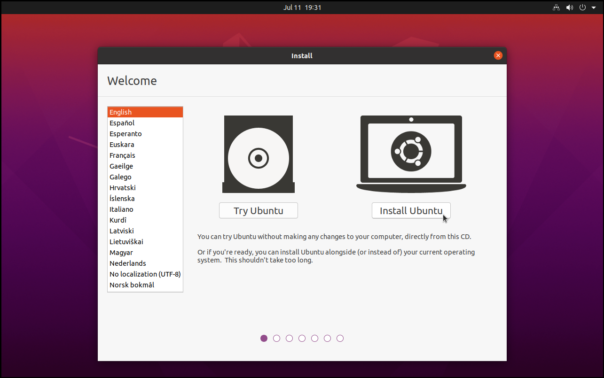
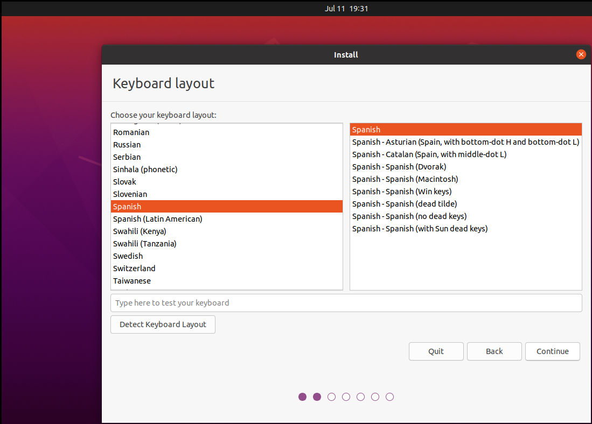
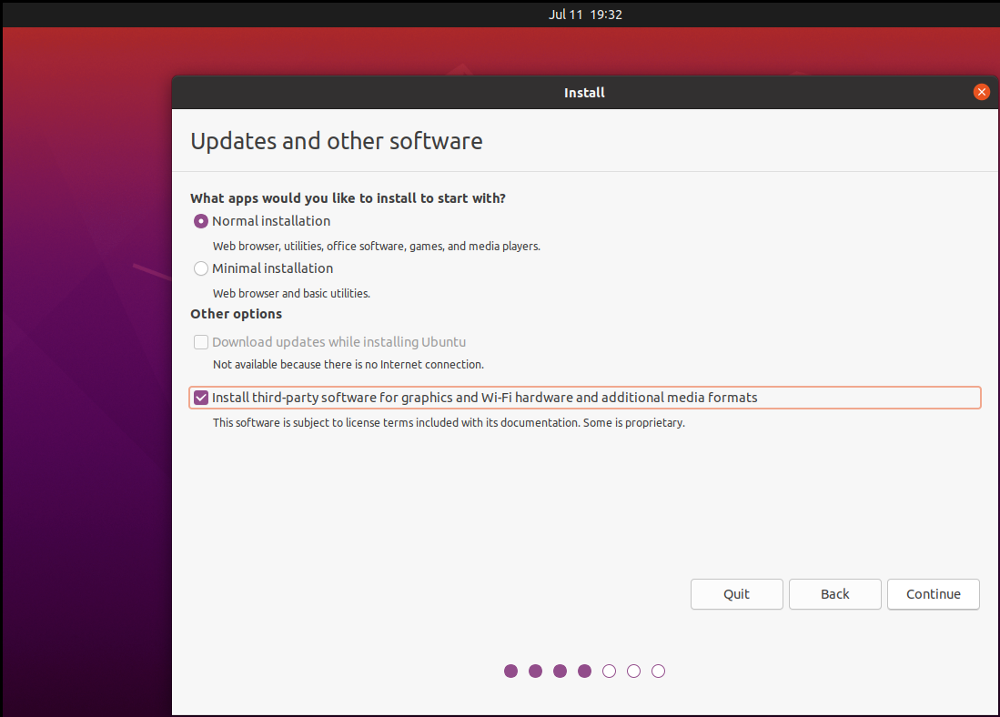
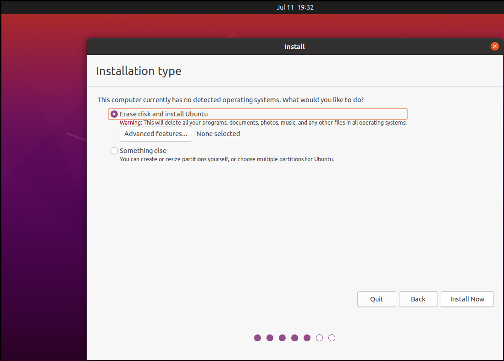
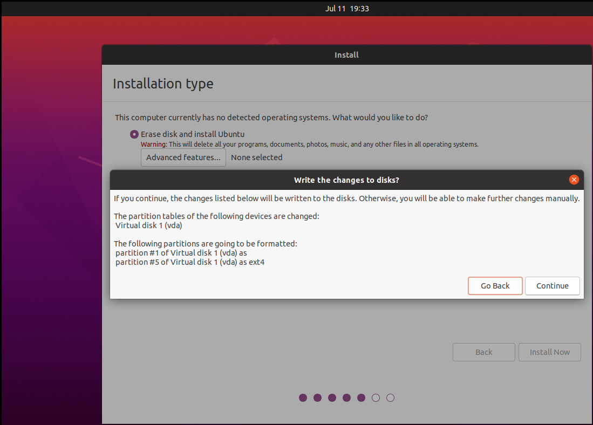
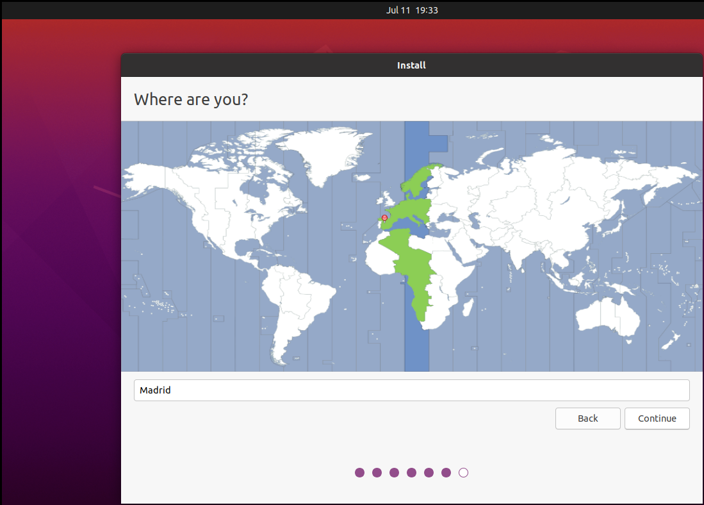
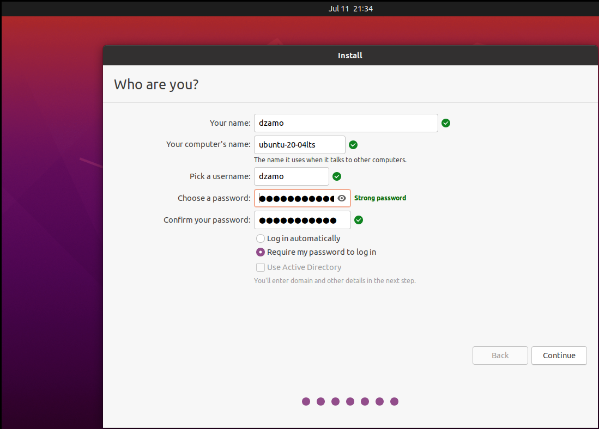
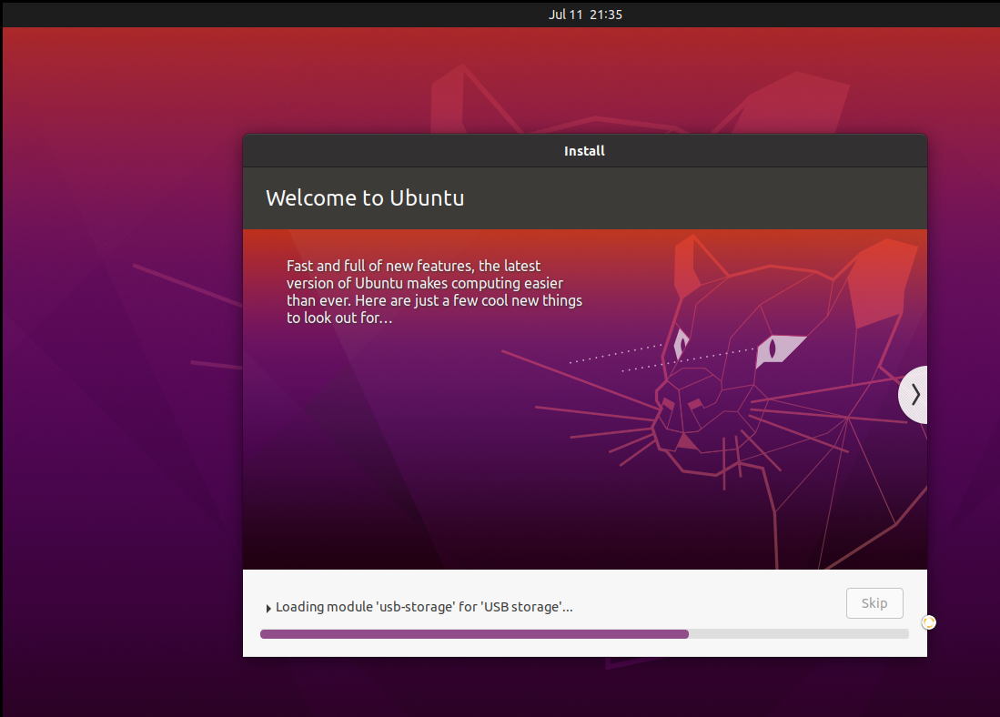
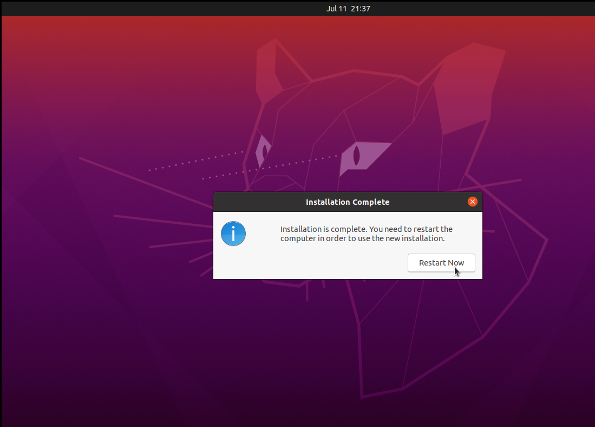

+++
author = "@dz"
title = "Instalación de Ubuntu 20.04 LTS Desktop"
date = "2025-07-13"
description = "Asistente de instalación de Ubuntu 20.04 LTS Desktop"
categories = [
    "course-3182",
    "linux-desktop"
]
tags = [
    "linux",
    "estudio",
    "escritorio"
]
image = "ubuntu-20-04-focal-fossa-dinahosting.jpg"
+++

Instalación de Ubuntu 20.04 LTS Destkop. <!-- more-->En este artículo se muestra el asistente (paso a paso) de la instalación de un Ubuntu 20.04 LTS Desktop.

## Primera pantalla del asistente

En este primer paso del asistente, seleccionar el idioma (del asistente de instalación) e `Install Ubuntu` para comenzar la instalación.

## Keyboard layout

> Seleccionar distribución del teclado
>

## Updates and other software

## Installation type

> Seleccionar tipo de instalación

### Write the changes to disks

> Confirmar/aceptar escritura sobre el disco

## Where are you - timezone

> Configurar zona

## Who are you - user and hostname

> Configurar usuario y nombre de host

## Installation progress

> Progreso de la instalación

### Installation Complete

> Instalación completada

