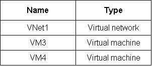

### Parte 1: Uso de Anki y/o ficheros VCE - ¿Cuál es mejor?

Para el estudio y/o preparación de alguna certificación, la estrategia más poderosa es usar **ambos**, pero en diferentes fases de tu preparación.

| Característica | Anki (Tarjetas de Repetición Espaciada) | Ficheros VCE (Simuladores de Examen) |
| :--- | :--- | :--- |
| **Propósito Principal** | **Aprender y Retener** | **Evaluar y Practicar** |
| **Método** | **Recuerdo Activo (Active Recall):** Debes *producir* la respuesta desde tu memoria. | **Reconocimiento Pasivo:** Debes *reconocer* la respuesta correcta entre varias opciones. |
| **Beneficio Clave** | Construye una base de conocimiento sólida y duradera. Te fuerza a entender el *porqué* de las cosas. | Te familiariza con el formato, el tiempo y el tipo de preguntas del examen real. Ayuda a identificar tus áreas débiles. |
| **Cuándo Usarlo** | **Diariamente, desde el principio de tu estudio.** Es tu gimnasio mental para fortalecer el conocimiento. | **En las últimas 1-2 semanas antes del examen.** Es el simulacro final para poner a prueba tu preparación. |
| **Riesgo** | Crear tarjetas de mala calidad (demasiada información, preguntas ambiguas) puede ser contraproducente. | Usarlos demasiado pronto te lleva a memorizar preguntas y respuestas sin entender los conceptos, lo cual es muy peligroso. Si en el examen la pregunta cambia un poco, fallarás. |

**Recomendación estratégica:**

1. **Fase de Aprendizaje (80% del tiempo):** Usa los cursos de Microsoft Learn, documentación oficial, y videos. Mientras estudias, **crea tus propias tarjetas Anki** para los conceptos clave, comandos de PowerShell/CLI, límites de servicio y escenarios como el que me pasaste.
2. **Fase de Evaluación (20% del tiempo):** Unas semanas antes del examen, empieza a usar los ficheros VCE. Su objetivo no es aprender material nuevo, sino:
    * Medir tu tiempo.
    * Acostumbrarte a la presión del examen.
    * Detectar patrones en las preguntas.
    * Identificar los conceptos que, a pesar de estudiar, aún no dominas. Si fallas una pregunta en el VCE, ¡crea una tarjeta Anki sobre ese concepto!

**Conclusión:** No abandones los VCE, pero no dependas de ellos para aprender. Úsalos como una herramienta de evaluación final. Tu principal aliado para la retención a largo plazo y la comprensión profunda es Anki.

---

### Parte 2: Cómo convertir el escenario en una tarjeta Anki

Crear una buena tarjeta Anki a partir de un escenario complejo es un arte. La regla de oro es el **Principio de Mínima Información**: cada tarjeta debe preguntar una sola cosa. Un escenario como este no debería ser una sola tarjeta gigante, sino que se puede descomponer.

Para este caso específico, el tipo de tarjeta ideal en Anki es **"Ocultar Oclusión" (Cloze Deletion)**. Te permite mostrar todo el contexto y ocultar solo las respuestas.

Aquí te muestro cómo crearías la tarjeta en Anki:

**1. Abre Anki y haz clic en "Añadir".**
**2. Selecciona el tipo de nota "Ocultar Oclusión" (Cloze).**
**3. En el campo "Texto", pega y formatea lo siguiente:**

```html
<!-- Pega aquí todo el contexto del escenario -->
<b><u>Scenario:</u></b>
<p>Litware, Inc. is a consulting company that has a main office in Montreal and two branch offices in Seattle and New York.</p>
... (resto del texto del escenario)...

<!-- Inserta las imágenes. Puedes copiarlas y pegarlas directamente en el editor de Anki -->
<br>

<br>

<br>

<!-- Pega la pregunta específica -->
<b><u>Requirement:</u></b>
<p>You need to meet the connection requirements for the New York office.</p>
<p><i>Connect the New York office to VNet1 over the Internet by using an encrypted connection.</i></p>
<p>What should you do?</p>
<hr>

<!-- Ahora, crea las oclusiones (las respuestas ocultas) -->
<b>Answer Area:</b>
<br>
From the Azure portal: {{c1::Create a virtual network gateway and a local network gateway}}
<br>
In the New York office: {{c2::Configure a site-to-site VPN connection}}
```

**4. En el campo "Extra (Back Extra)", pega la justificación detallada.**

Esto es CRUCIAL. El verdadero aprendizaje ocurre al revisar por qué la respuesta es correcta.

```html
<b><u>Justification:</u></b>

<p>The requirement is to connect the New York office to VNet1 <b>over the Internet</b> using an <b>encrypted connection</b>. This is the exact definition of a <b>Site-to-Site (S2S) VPN</b>.</p>

<ol>
  <li>
    <b>From the Azure portal (c1):</b> To create an S2S VPN, you need two core components in Azure:
    <ul>
      <li>A <b>Virtual Network Gateway</b>: This is the VPN endpoint on Azure's side of the connection.</li>
      <li>A <b>Local Network Gateway</b>: This is an Azure object that represents the on-premises VPN device (the firewall in New York), containing its public IP and local network address ranges.</li>
    </ul>
  </li>
  <li>
    <b>In the New York office (c2):</b> The on-premises device (firewall) must be configured to establish the other end of the VPN tunnel. This action is called <b>configuring a site-to-site VPN connection</b>.
  </li>
</ol>

<p><b>Why other options are wrong:</b> ExpressRoute is a private, dedicated connection, not over the internet, and it was planned for Montreal, not New York.</p>
```

#### ¿Cómo se verá esto en la práctica?

Cuando Anki te muestre esta nota, lo hará en dos pasos (porque usamos `c1` y `c2`):

*   **Primera Tarjeta (Prueba de `c1`):**
    *   **Frente:** Verás todo el escenario, pero la primera respuesta estará oculta como `[...]`. La segunda respuesta será visible.
    *   **Reverso:** Se revelará la respuesta `Create a virtual network gateway and a local network gateway` y verás la justificación completa.

*   **Segunda Tarjeta (Prueba de `c2`):**
    *   **Frente:** Verás todo el escenario, la primera respuesta será visible, y la segunda estará oculta como `[...]`.
    *   **Reverso:** Se revelará la respuesta `Configure a site-to-site VPN connection` y verás la justificación completa.

Este método es increíblemente eficaz porque:
1.  Mantiene todo el contexto del escenario.
2.  Te obliga a recordar activamente cada parte de la solución de forma independiente.
3.  Refuerza el conocimiento con una justificación detallada en cada revisión.