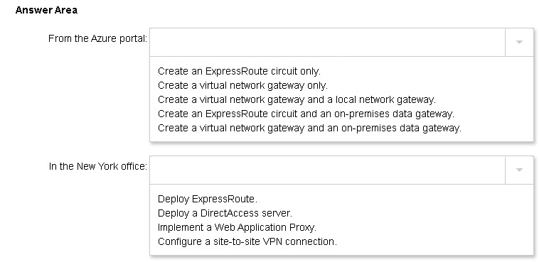

## Caso de uso 001

Litware, Inc. is a consulting company that has a main office in Montreal and two branch offices in Seattle and New York.
The Montreal office has 2,000 employees. The Seattle office has 1,000 employees. The New York office has 200 employees.
All the resources used by Litware are hosted on-premises.
Litware creates a new Azure subscription. The Azure Active Directory (Azure AD) tenant uses a domain named litware.onmicrosoft.com. The tenant uses the Premium P1 pricing tier.

### Existing Environment
The network contains an Active Directory forest named litware.com. All domain controllers are configured as DNS servers and host the litware.com DNS zone.
Litware has finance, human resources, sales, research, and information technology departments. Each department has an organizational unit (OU) that contains all the accounts of that respective department. All the user accounts have the department attribute set to their respective department. New users are added frequently.
Litware.com contains a user named User1.
All the offices connect by using private connections.
Litware has data centers in the Montreal and Seattle offices. Each office has a firewall that can be configured as a VPN device.
All infrastructure servers are virtualized. The virtualization environment contains the servers in the following table: 

Litware uses two web applications named App1 and App2. Each instance on each web application requires 1 GB of memory.
The Azure subscription contains the resources in the following table: 

The network security team implements several network security groups (NSGs)

### Requirements

#### Planned Changes

Litware plans to implement the following changes:
Deploy Azure ExpressRoute to the Montreal office.
Migrate the virtual machines hosted on Server1 and Server2 to Azure.
Synchronize on-premises Active Directory to Azure Active Directory (Azure AD).
Migrate App1 and App2 to two Azure web apps named WebApp1 and WebApp2.

## Technical Requirements

Litware must meet the following technical requirements:
Ensure that WebApp1 can adjust the number of instances automatically based on the load and can scale up to five instances.

Ensure that VM3 can establish outbound connections over TCP port 8080 to the applications servers in the Montreal office.
Ensure that routing information is exchanged automatically between Azure and the routers in the Montreal office.
Enable Azure Multi-Factor Authentication (MFA) for the users in the finance department only.
Ensure that webapp2.azurewebsites.net can be accessed by using the name app2.litware.com.
Connect the New York office to VNet1 over the Internet by using an encrypted connection.
Create a workflow to send an email message when the settings of VM4 are modified.
Create a custom Azure role named Role1 that is based on the Reader role.
Minimize costs whenever possible.
You need to meet the connection requirements for the New York office.

## What should you do? 

To answer, select the appropriate options in the answer area. 

