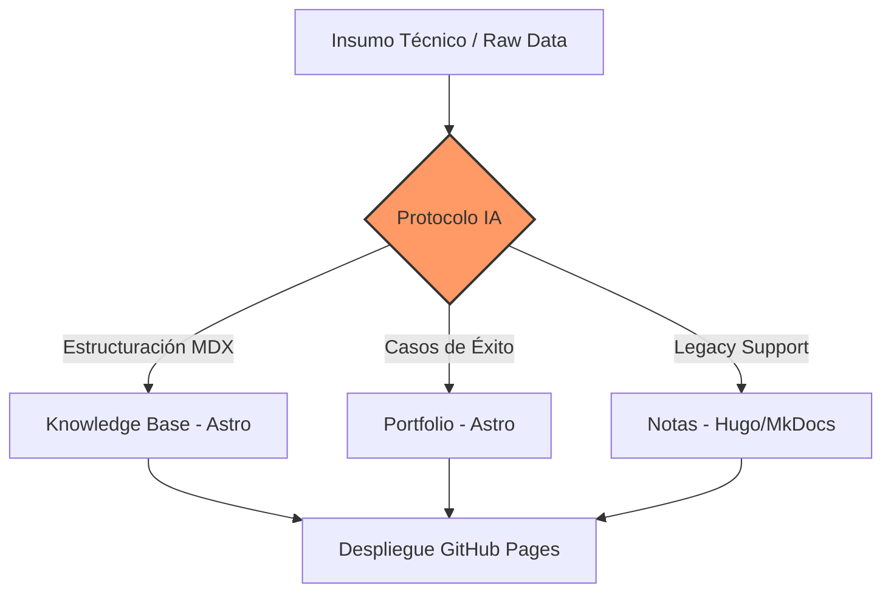

- Estructura:
```bash

dzamo@aspire-a315-59:~/my-workspace/in_github.com/daniel-zamo.github.io/kb$ ls -l
total 352
-rw-r--r--   1 dzamo dzamo    718 ene 17 09:02 astro.config.mjs
drwxr-xr-x  10 dzamo dzamo   4096 ene 16 21:22 docs
-rw-r--r--   1 dzamo dzamo   1284 ene 16 21:53 frontmatter.json
-rw-r--r--   1 dzamo dzamo   1074 ene 13 20:40 LICENSE
drwxr-xr-x 402 dzamo dzamo  20480 ene 17 08:21 node_modules
-rw-r--r--   1 dzamo dzamo    358 ene 17 08:21 package.json
-rw-r--r--   1 dzamo dzamo 282119 ene 17 08:50 package-lock.json
drwxr-xr-x   2 dzamo dzamo   4096 ene 17 08:23 public
-rw-r--r--   1 dzamo dzamo   1863 ene 16 21:07 README.md
drwxr-xr-x   5 dzamo dzamo   4096 ene 17 07:59 src
-rw-r--r--   1 dzamo dzamo    109 ene 16 14:37 tsconfig.json

dzamo@aspire-a315-59:~/my-workspace/in_github.com/daniel-zamo.github.io/kb$ tree src/
src/
├── assets
│   └── houston.webp
├── content
│   └── docs
│       ├── ai-protocols
│       │   ├── index.mdx
│       │   └── master-note-generator-astro-starlight.md
│       ├── guides
│       │   └── example.md
│       ├── index.mdx
│       └── reference
│           └── example.md
├── content.config.ts
└── styles
    └── custom.css
	
dzamo@aspire-a315-59:~/my-workspace/in_github.com/daniel-zamo.github.io/kb$ tree public/
public/
├── favicon.svg
└── mermaid-init.js

dzamo@aspire-a315-59:~/my-workspace/in_github.com/daniel-zamo.github.io/kb$ tree public/
public/
├── favicon.svg
└── mermaid-init.js

```

- src/content/docs/ai-protocols/index.mdx

```mdx
---
title: Protocolos de IA
description: Metodologías de ingeniería para la generación de activos de documentación técnica mediante modelos de lenguaje.
sidebar:
  label: Protocolos IA
  badge:
    text: Estándar
    variant: success
---

import { Steps, Aside, Badge, LinkButton, Card, CardGrid } from '@astrojs/starlight/components';

Metodologías y prompts maestros diseñados para transformar conversaciones técnicas en activos de documentación de alta fidelidad, asegurando la consistencia semántica y estructural en todo el ecosistema de conocimiento.

## Arquitectura del Flujo de Documentación

El siguiente diagrama describe el proceso de transformación de insumos técnicos raw hacia activos finales integrados en el pipeline de documentación:



## Protocolos Disponibles

Seleccione el estándar de documentación según el objetivo del activo técnico:

<CardGrid>
  <Card title="Portfolio (Astro)" icon="star">
    Generador de Casos de Éxito optimizado para el sitio principal. Enfocado en métricas y resultados de ingeniería.
    <br />
    <LinkButton href="/kb/ai-protocols/portfolio-astro/">Ver protocolo</LinkButton>
  </Card>
  
  <Card title="Notas de Ingeniería" icon="document">
    Protocolo especializado en la captura de soluciones técnicas y arquitecturas bajo estándares MkDocs/Hugo.
    <br />
    <LinkButton href="/kb/ai-protocols/engineering-notes/" variant="secondary">Ver protocolo</LinkButton>
  </Card>
</CardGrid>

## Versiones del Generador

Contamos con diferentes iteraciones del motor de prompts según la complejidad del menú lateral y la experiencia de usuario requerida.

### Optimización de Salida

<Steps>
1.  **Captura de Contexto:** Definición del rol del especialista y el alcance del sistema.
2.  **Procesamiento:** Aplicación del protocolo seleccionado (v1 o v2).
3.  **Validación:** Verificación de Frontmatter y compatibilidad con el cargador `docsLoader`.
</Steps>

<Aside type="tip">
  Para proyectos nuevos, se recomienda el uso estricto del **Generador v2** debido a su capacidad de generar estructuras jerárquicas con `sidebar` limpio.
</Aside>

### Comparativa de Versiones

| Versión | Estado | Aplicación Principal | Arquitectura |
| :--- | :--- | :--- | :--- |
| **Generador v2** | <Badge text="Recomendado" variant="success" /> | Documentación UX-First | MDX / Astro |
| **Generador v1** | <Badge text="Legacy" variant="caution" /> | Captura inicial de conocimiento | Markdown Plano |

---

### Enlaces de Referencia

*   <LinkButton href="/kb/ai-protocols/generator-v2/" variant="minimal">Acceder a Generador v2 (Optimizado)</LinkButton>
*   <LinkButton href="/kb/ai-protocols/generator-v1/" variant="minimal">Acceder a Generador v1 (Base)</LinkButton>

```

- astro.config.mjs
```mjs
import { defineConfig } from 'astro/config';
import starlight from '@astrojs/starlight';

export default defineConfig({
	site: 'https://daniel-zamo.github.io',
	base: '/kb', // Base URL crítica para assets
	integrations: [
		starlight({
			title: 'Notas Técnicas',
			defaultLocale: 'es',
			sidebar: [
				{
					label: 'Inicio',
					link: '/',
				},
				{
					label: 'Notas',
					autogenerate: { directory: '' },
				},
			],
			customCss: ['./src/styles/custom.css'],
			head: [
				{
					tag: 'script',
					attrs: {
						type: 'module',
						// Usamos la ruta absoluta incluyendo el base para despliegue en GH Pages
						src: '/kb/mermaid-init.js',
						defer: true,
					},
				},
			],
		}),
	],
});

```

- src/content.config.ts (typescript)
```ts
import { defineCollection } from 'astro:content';
import { docsLoader } from '@astrojs/starlight/loaders';
import { docsSchema } from '@astrojs/starlight/schema';

export const collections = {
	docs: defineCollection({ loader: docsLoader(), schema: docsSchema() }),
};

```

- public/mermaid-init.js
```javascript
// Importación dinámica para asegurar compatibilidad con ESM y el base path /kb/
import mermaid from 'https://cdn.jsdelivr.net/npm/mermaid@10/dist/mermaid.esm.min.mjs';

// Configuración de motor gráfico
mermaid.initialize({
  startOnLoad: false,
  theme: 'dark',
  securityLevel: 'loose',
  fontFamily: 'var(--sl-font-mono)',
  flowchart: {
    htmlLabels: true,
    useMaxWidth: true,
    curve: 'basis'
  }
});

/**
 * Orquestador de renderizado para bloques de código Mermaid
 */
const renderMermaid = async () => {
  // Shiki en Starlight genera: figure.sl-code > pre > code.language-mermaid
  const codeBlocks = document.querySelectorAll('code.language-mermaid');

  for (const codeElement of codeBlocks) {
    const rawCode = codeElement.innerText.trim();
    const container = codeElement.closest('pre');
    const figure = container?.parentElement;

    if (rawCode && container) {
      try {
        const id = `mermaid-svg-${Math.random().toString(36).substring(2, 9)}`;
        const { svg } = await mermaid.render(id, rawCode);

        // Creamos un wrapper para el diagrama
        const wrapper = document.createElement('div');
        wrapper.className = 'mermaid-diagram-container';
        wrapper.innerHTML = svg;

        // Sustitución controlada del DOM para evitar parpadeos (FOUC)
        if (figure && figure.tagName === 'FIGURE') {
          figure.replaceWith(wrapper);
        } else {
          container.replaceWith(wrapper);
        }
      } catch (error) {
        console.error('[Mermaid-Platform-Error]: Fallo en renderizado de diagrama', error);
      }
    }
  }
};

// Registro en el ciclo de vida de Astro (Crucial para View Transitions)
document.addEventListener('astro:page-load', renderMermaid);

// Fallback para ejecución inmediata
if (document.readyState === 'complete') {
  renderMermaid();
} else {
  window.addEventListener('load', renderMermaid);
}

```

- src/styles/custom.css
```css
/* Maximizar el ancho del contenido */
/*
:root {
    --sl-content-width: 100% !important;
    --sl-text-base: 1.1rem;
}
*/

/* Opcional: Ajustar el layout para que no se pegue a los bordes */
/*
.main-frame {
    max-width: 100vw;
}

.content-panel {
    max-width: 95% !important;
    margin: 0 auto;
}
*/
/* Optimizaciones de visualización para diagramas de arquitectura */

.mermaid-diagram-container {
    display: flex;
    justify-content: center;
    background-color: var(--sl-color-gray-6);
    padding: 1.5rem;
    border-radius: 0.5rem;
    margin: 1.5rem 0;
    border: 1px solid var(--sl-color-gray-5);
    overflow-x: auto;
}

.mermaid-diagram-container svg {
    max-width: 100% !important;
    height: auto !important;
}

/* Forzar legibilidad de textos en diagramas */
.mermaid-diagram-container .node text,
.mermaid-diagram-container .edgeLabel {
    fill: var(--sl-color-white) !important;
    font-family: var(--sl-font-mono) !important;
}

/* Ocultar el bloque original antes de que el JS lo procese para evitar salto visual */
code.language-mermaid {
    display: none;
}
```
