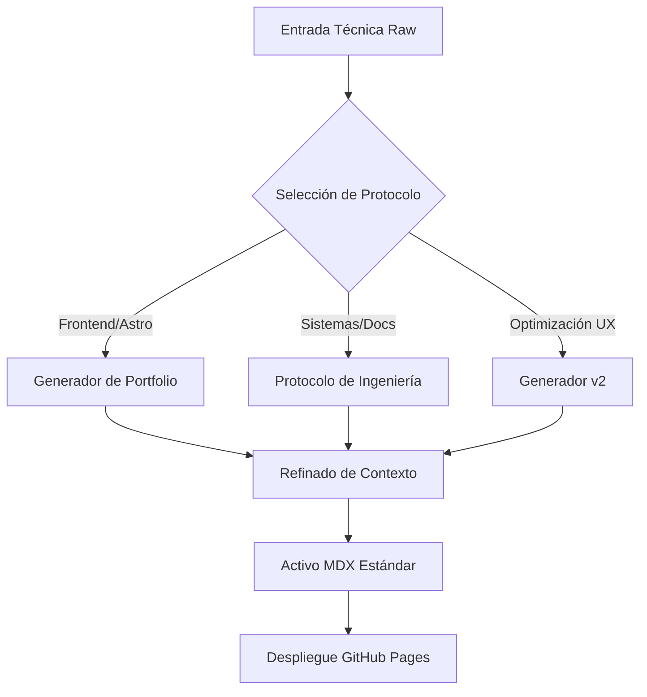

import { Steps, Aside, Badge, LinkButton, Card, CardGrid } from '@astrojs/starlight/components';

Metodologías de orquestación de LLMs diseñadas para la transformación de conocimiento táctico en activos de documentación de alta fidelidad. Estos protocolos aseguran la consistencia arquitectónica y el cumplimiento de estándares de ingeniería en cada iteración de contenido.

## Arquitectura de Generación de Conocimiento

El siguiente flujo describe el proceso de transformación desde la captura de requerimientos técnicos hasta la publicación en el Knowledge Base (KB):

## Protocolos Disponibles

Seleccione el framework de ejecución según el tipo de activo técnico requerido:

<CardGrid>
  <Card title="Portfolio (Astro)" icon="star">
    Especializado en la generación de **Casos de Éxito**. Optimizado para resaltar métricas de rendimiento y stack tecnológico en el sitio principal.
    
    <LinkButton href="/kb/ai-protocols/astro-portfolio" variant="secondary" icon="right-arrow">
      Ejecutar Protocolo
    </LinkButton>
  </Card>

  <Card title="Notas de Ingeniería" icon="document">
    Protocolo de captura para **soluciones de infraestructura**. Prioriza la deuda técnica, decisiones de arquitectura (ADR) y configuraciones críticas.
    
    <LinkButton href="/kb/ai-protocols/engineering-notes" variant="secondary" icon="right-arrow">
      Ejecutar Protocolo
    </LinkButton>
  </Card>

  <Card title="Generador v2 (UX)" icon="rocket">
    <Badge text="Recomendado" variant="success" />
    Versión optimizada para interfaces modernas. Genera menús laterales limpios y estructuras MDX compatibles con componentes Astro.
    
    <LinkButton href="/kb/ai-protocols/generator-v2" variant="primary" icon="right-arrow">
      Ir a v2
    </LinkButton>
  </Card>

  <Card title="Legacy Core (v1)" icon="history">
    <Badge text="Legacy" variant="note" />
    Protocolo inicial de captura de conocimiento. Mantener solo para compatibilidad con sistemas basados en Markdown plano.
    
    <LinkButton href="/kb/ai-protocols/generator-v1" variant="minimal" icon="right-arrow">
      Ver v1
    </LinkButton>
  </Card>
</CardGrid>

<Aside type="caution" title="Estándar de Seguridad">
Todos los prompts generados bajo estos protocolos deben ser auditados para evitar la filtración de secretos, tokens de API o datos sensibles de infraestructura antes de su persistencia en el repositorio.
</Aside>

## Pipeline de Ejecución

<Steps>
1. **Identificación de Contexto:** Determinar si el activo es una referencia técnica, un tutorial de plataforma o un registro de arquitectura.
2. **Inyección de Prompt:** Seleccionar el protocolo correspondiente de la lista superior e inyectar el contexto técnico en el LLM.
3. **Validación MDX:** Verificar que los componentes de Starlight (Asides, Cards, Steps) se rendericen correctamente según el esquema definido.
4. **Persistencia:** Commit del archivo `.mdx` en la ruta `src/content/docs/` siguiendo la convención de nombres de la plataforma.
</Steps>