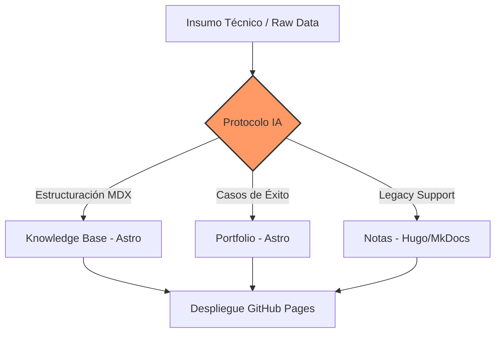

import { Steps, Aside, Badge, LinkButton, Card, CardGrid } from '@astrojs/starlight/components';

Metodologías y prompts maestros diseñados para transformar conversaciones técnicas en activos de documentación de alta fidelidad, asegurando la consistencia semántica y estructural en todo el ecosistema de conocimiento.

## Arquitectura del Flujo de Documentación

El siguiente diagrama describe el proceso de transformación de insumos técnicos raw hacia activos finales integrados en el pipeline de documentación:

## Protocolos Disponibles

Seleccione el estándar de documentación según el objetivo del activo técnico:

<CardGrid>
  <Card title="Portfolio (Astro)" icon="star">
    Generador de Casos de Éxito optimizado para el sitio principal. Enfocado en métricas y resultados de ingeniería.
     
    <LinkButton href="/kb/ai-protocols/portfolio-astro/">Ver protocolo</LinkButton>
  </Card>
  
  <Card title="Notas de Ingeniería" icon="document">
    Protocolo especializado en la captura de soluciones técnicas y arquitecturas bajo estándares MkDocs/Hugo.
     
    <LinkButton href="/kb/ai-protocols/engineering-notes/" variant="secondary">Ver protocolo</LinkButton>
  </Card>
</CardGrid>

## Versiones del Generador

Contamos con diferentes iteraciones del motor de prompts según la complejidad del menú lateral y la experiencia de usuario requerida.

### Optimización de Salida

<Steps>
1.  **Captura de Contexto:** Definición del rol del especialista y el alcance del sistema.
2.  **Procesamiento:** Aplicación del protocolo seleccionado (v1 o v2).
3.  **Validación:** Verificación de Frontmatter y compatibilidad con el cargador `docsLoader`.
</Steps>

<Aside type="tip">
  Para proyectos nuevos, se recomienda el uso estricto del **Generador v2** debido a su capacidad de generar estructuras jerárquicas con `sidebar` limpio.
</Aside>

### Comparativa de Versiones

| Versión | Estado | Aplicación Principal | Arquitectura |
| :--- | :--- | :--- | :--- |
| **Generador v2** | <Badge text="Recomendado" variant="success" /> | Documentación UX-First | MDX / Astro |
| **Generador v1** | <Badge text="Legacy" variant="caution" /> | Captura inicial de conocimiento | Markdown Plano |

---

### Enlaces de Referencia

*   <LinkButton href="/kb/ai-protocols/generator-v2/" variant="minimal">Acceder a Generador v2 (Optimizado)</LinkButton>
*   <LinkButton href="/kb/ai-protocols/generator-v1/" variant="minimal">Acceder a Generador v1 (Base)</LinkButton>
